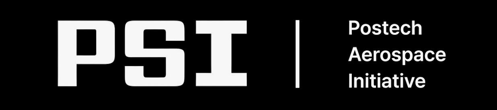

# About Us

  <a href="https://www.instagram.com/postech_psi/" target="_blank">
    
    Instagram
  </a> •
  <a href="https://postech-psi.github.io/psi-website/" target="_blank">PSI Website</a> •
  

  

**PSI is a research-focused aerospace student group at POSTECH in the Department of Mechanical Engineering.**

It was founded to:

- Give any POSTECH student who is interested in aerospace a chance to share aerospace knowledge.
- Provide opportunities to participate directly in real development and fabrication.

Core principles:

- Develop capability as aerospace researchers.
- Avoid pure hobby focus; prioritize research-centered work.
- Provide design and manufacturing opportunities on actual vehicles and systems.

---

## Timeline of Major Milestones

- **2024-02-20** – PSI founded.
- **2024-03-06** – First regular club meeting held.
- **2024-05-06** – KNSB solid rocket motor safety verification test succeeded.
- **2024-05-15** – KNSB solid rocket motor thrust measurement test succeeded.
- **2024-07-04** – KNSB 400 g thrust measurement test for PSLV-1 succeeded.
- **2024-11-15** – Solid-propellant sounding rocket PSLV-I successfully launched at the National Comprehensive Performance Test Range (KARI Goheung).
- **2025-02-13** – 2024 UGRP (Undergraduate Research Program): 3 PSI teams received awards.
- **2025-03-25** – Participation in Korean Robot Aircraft Competition. 
- **2025-06-26** – Participation in KAIST CanSat Competition. 
- **2025-07-20** – Presentation at NURA academic conference based on PSLV-1 technology; received Korea Aerospace Research Institute President’s Award.
- **2025-08-09** – Solid-propellant sounding rocket PSLV-I successfully launched in the NURA launch competition with advanced avionics.
- **2025-11-14** – Poster presentations at the Korean Society for Aeronautical & Space Sciences (KSAS) Fall Conference (4 teams).
- **2025-12-02** – Received POSTECH Undergraduate POSTECHIAN Award.
- **2025-12-03** – Oral presentations at the Korean Society of Propulsion Engineers (KSPE) Fall Conference (3 teams).
- **2025-12-05** – Solid-propellant sounding rocket PSLV-II successfully launched at the National Comprehensive Performance Test Range (KARI Goheung); parachute deployment and 360° video mission successfully completed.
- **2026-02-06** – 2025 UGRP (Undergraduate Research Program): 3 PSI teams received awards (11,000,000 KRW).
